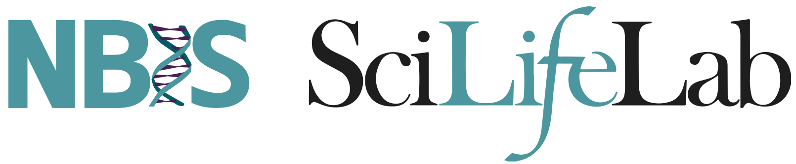

```{r,child="assets/header-lab.Rmd"}
```



<p class="large" style="line-height:150%;margin-bottom:30px;">
Welcome to this workshop on RNA-Seq. This course aims to cover the most important aspects of RNA-Seq analysis using next generation sequencing data. We cover quality control, mapping, quantification and differential gene expression.
</p>

<div class="medium" style="line-height:150%;">
* Before the course, please ensure that you have completed the **[Precourse](precourse.html)** steps.
* For practical information regarding the course venue and travel information, see **[Info](info.html)**.
* See **[Schedule](schedule.html)** for the current course plan in chronological order.
* All lab materials have been collected in a single location, organised into **main** workflow and **bonus** sections, see **[Lab](lab.html)**.
</div>

---

<div class="small">
`r paste0("Last updated on  <i class='fa fa-calendar' aria-hidden='true'></i> ",format(Sys.time(),format='%d-%b-%Y')," at  <i class='fa fa-clock-o' aria-hidden='true'></i> ",format(Sys.time(),format='%X'),".")`
</div>
