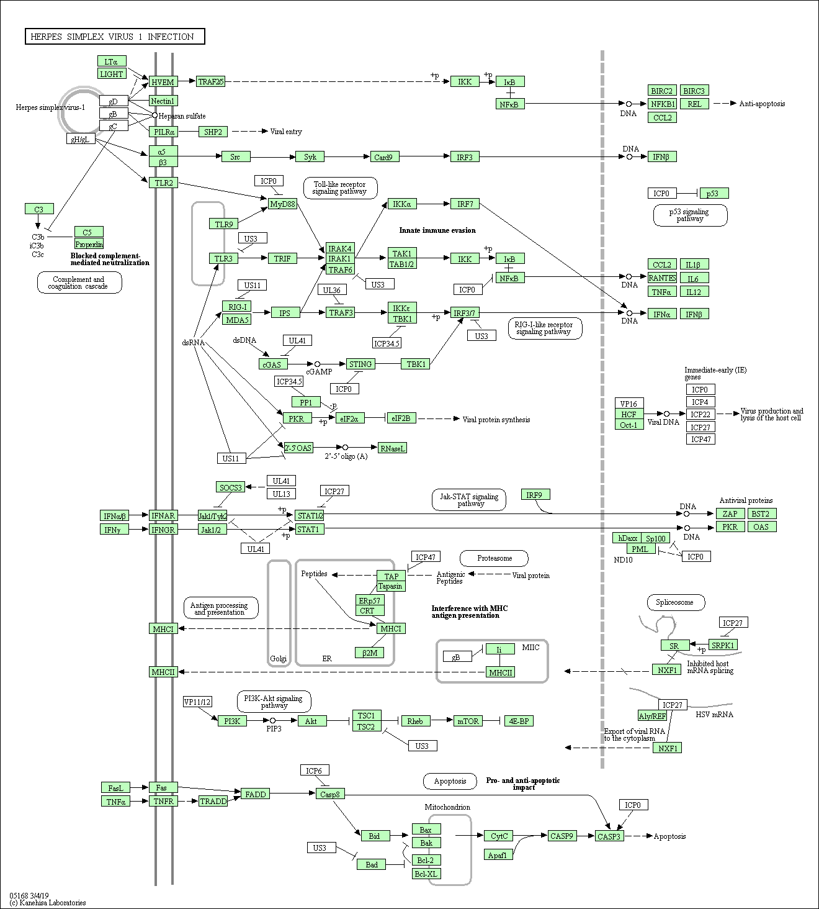
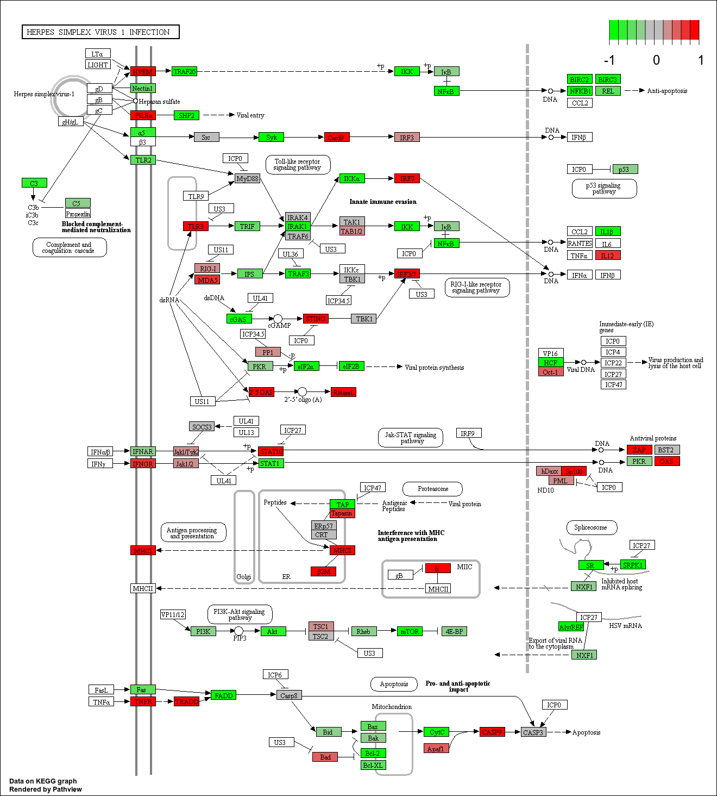

```{r,child="assets/header-lab.Rmd"}
```

```{r,include=FALSE}
weblink <- "https://raw.githubusercontent.com/NBISweden/course_rnaseq_slu/master/data/"
```

# Loading data

<div class="instruction">
<i class="fas fa-exclamation-circle"></i> The files needed during this exercise are provided as URLs. The files can be saved as a text file in your working directory under a directory labelled `data` to follow the tutorial exactly as written. Alternatively, you can provide the URL directly to the `read.table()` function like this `read.table('url-to-file.txt',header=TRUE)`.
</div>

Loading packages.

```{r}
library(clusterProfiler)
library(org.Hs.eg.db)
library(ggpubr)
library(pathview)
```

Now we read in the data. The differential gene expression results are here: ``r paste0(weblink,"deg-time_t24_vs_t0.txt")``. We are only using one of the results/comparisons in this workflow for demonstration purposes.

```{r}
deg <- read.delim("./data/deg-time_t24_vs_t0.txt",header=TRUE,stringsAsFactors=F)
# remove rows with NAs
deg <- na.omit(deg)
# remove duplicated entrez genes
deg <- deg[!duplicated(deg$entrezgene),]
head(deg)
```

The idea behind functional analyses is to find out there is a pattern to your list of differentially expressed genes (DEGs). Are they completely random? Or do they work together in a pathway or are they involved in a common biological function? There are numerous tools out there for this purpose that differ slightly in algorithm and variation in methods used. Here are a few:

R-packages | Comments
--- | ---
topGO | GO
goana | GO
goseq | GO, KEGG, Gene length bias correction
topKEGG | KEGG
kegga | KEGG
enrichR | GO, KEGG, many others
piano | GO, KEGG, GSEA, many others, enrichment consensus
ClusterProfiler | GO, KEGG, GSEA, many others, nice plots!
Pathview | Nice visualization for KEGG pathways
fgsea | GSEA
gProfileR | ORA

 We will use an R package called clusterProfiler.  [clusterProfiler](https://bioconductor.org/packages/release/bioc/vignettes/clusterProfiler/inst/doc/clusterProfiler.html) is an R package that supports gene enrichment and gene set enrichment analyses. It also has useful visualisation functions.
 
# Gene enrichment

The most common functional analyses carried out post differential-gene-expression is a gene enrichment test. The idea is to identify if our set of differentially expressed genes are significantly over-represented in a pre-defined set of genes that biologically function together. These pre-defined sets of genes are maintained in a database such as [Gene ontology](http://geneontology.org/), [Reactome](https://reactome.org/), [Kegg](https://www.genome.jp/kegg/) etc. This is usually an over-representation test like the hypergeometric test. The input needed for such a test is simply a character list of differentially expressed genes, the total list of genes tested during differential expression and a database of gene sets.

The hypergeometric test works roughly like this:

You have 2000 differentially expressed genes of which 50 genes are associated with the term **Cell death**. The percentage of differentially expressed genes involved with **Cell death** is 2000/50=40%. But, we also need to considered what is the background expected percentage. There are 15000 genes in total of which 100 genes are defined in the term **Cell death**. The percentage of all genes involved with Cell death is 100/15000=0.006%. Therefore, our list of differentially expressed genes show an obvious enrichment of Cell death genes over the background.

Here is how to run a fisher test using the same data.

```{r}
d <- matrix(c(50,50,1950,14900),nrow=2,dimnames=list(c("de","not_de"),c("in_gs","not_in_gs")))
d
```

```{r}
fisher.test(d,alternative="greater")
```

We will used R package clusterProfiler for over-representation analyses. Prepare named vectors with DEGs and background genes.

```{r}
library(clusterProfiler)
deg1 <- deg[deg$padj<0.05 & abs(deg$log2FoldChange)>1,]

# differentially expressed genes ids
degs <- as.character(deg1$entrezgene)
# all gene ids
bgs <- as.character(deg$entrezgene)
```

## GO

Then we run the enrichment analyses on GO database using the function `enrichGO()`. Notice that we have provided entrez gene IDs of differentially expressed genes (`names(g)`), entrez gene IDs of all DE tested genes (`names(bg)`) as the universe. Further we indicate that the human database is to be used and the sub-ontology of GO such as CC, BP or MF.

```{r,eval=FALSE}
ego_cc <- enrichGO(gene=degs,universe=bgs,OrgDb=org.Hs.eg.db,ont="CC",
                    pvalueCutoff=0.01,qvalueCutoff=0.05,readable=TRUE)
ego_bp <- enrichGO(gene=degs,universe=bgs,OrgDb=org.Hs.eg.db,ont="BP",
                    pvalueCutoff=0.01,qvalueCutoff=0.05,readable=TRUE)
ego_mf <- enrichGO(gene=degs,universe=bgs,OrgDb=org.Hs.eg.db,ont="MF",
                    pvalueCutoff=0.01,qvalueCutoff=0.05,readable=TRUE)
```

```{r,eval=FALSE,include=FALSE}
saveRDS(ego_cc,"./data/ego_cc.Rds")
saveRDS(ego_bp,"./data/ego_bp.Rds")
saveRDS(ego_mf,"./data/ego_mf.Rds")
```

```{r,include=FALSE}
ego_cc <- readRDS("./data/ego_cc.Rds")
ego_bp <- readRDS("./data/ego_bp.Rds")
ego_mf <- readRDS("./data/ego_mf.Rds")
```

This returns an `enrichResult` class object. 

```{r}
class(ego_cc)
```

We can peek into the results. To save the results as a text table, it must be converted into a `data.frame`.

```{r}
head(ego_cc)
```

These results can be visualised using barplots or scatterplots.

```{r,fig.height=8,fig.width=8}
library(ggpubr)
p1 <- barplot(ego_cc,showCategory=10,title="CC")
p2 <- barplot(ego_bp, showCategory=10,title="BP")
p3 <- barplot(ego_mf, showCategory=10,title="MF")
ggarrange(p1,p2,p3,nrow=3,ncol=1)
```

The figure shows the top 10 terms in the three sub-ontologies CC, MF and BP. X-axis denotes the number of DEGs in the term. Colour denotes the adjusted p-value of the term.

```{r,fig.height=8,fig.width=8}
library(ggpubr)
p1 <- dotplot(ego_cc,showCategory=10,title="CC")
p2 <- dotplot(ego_bp, showCategory=10,title="BP")
p3 <- dotplot(ego_mf, showCategory=10,title="MF")
ggarrange(p1,p2,p3,nrow=3,ncol=1)
```

This figure is showing similar information as the barplots. The x-axis now shows ratio of DEGs to number of genes in term. Size denotes counts of DEGs in the term and colour denotes adjusted p-value.

```{r,fig.height=6,fig.width=7}
emapplot(ego_cc,vertex.label.font=6)
```

The enrichment map shows a network graph of GO terms. The size of the nodes denote number of DEGs in that term. The links denote shared genes between terms. The thickness of the lines signify the number of shared genes. Colours again denote adjusted p-value of the enrichment test.

```{r,fig.height=7,fig.width=8}
bg <- deg$log2FoldChange
names(bg) <- as.character(deg$entrezgene)

cnetplot(ego_cc,foldChange=bg)
```

The gene-concept network graph shows the terms as well as the genes. The gene nodes are coloured by it's fold-change. We have provided the fold-change information for each gene additionally.

```{r}
heatplot(ego_cc,foldChange=bg)
```

The heatmap plot shows a heatmap of the GO terms and genes shared between them. Each point is coloured by the fold-change value of that gene.

## KEGG

Gene enrichment can also be run on KEGG database. This return pathway IDs which can be explored further.

```{r}
ek <- enrichKEGG(gene=degs,organism='hsa',pvalueCutoff=0.05)
head(ek)
```

All visualisation functions run previously also work on KEGG results. Feel free to plot and explore these results.

## Online tools

Below you can find a list with the most commonly used online enrichment tools. Each one differs a bit on what they can do.

Package | link | Database | Comment
--- | --- | --- | ---
Enrichr | http://amp.pharm.mssm.edu/Enrichr/ | GO, KEGG, TF,  many others  | Extensive libraries
GOrilla | http://cbl-gorilla.cs.technion.ac.il | GO | Support for REVIGO
REVIGO | http://revigo.irb.hr | GO | Summarises redundancy
DAVID | https://david.ncifcrf.gov | GO, KEGG, TF, many others | *Not updated
KEGG | https://www.genome.jp/kegg/ | KEGG | Shows the pathways
Reactome | https://www.reactome.org | KEGG-like | Shows the pathways/reactions
Panther | http://www.pantherdb.org/about.jsp | GO | Evolutionary conserved GO annotation

# GSEA

Gene set enrichment analyses (GSEA) uses p-values or log2 fold-changes for all genes from the differential expression results, to identify if gene sets work together in a coordinated manner. The primary difference with gene enrichment test is that there no cut-off or threshold to identify differentially expressed genes. All genes are considered along with a metric. One advantage is that in situations where there are no individual genes with large fold-changes but many genes with low fold-change may work together to produce a significant effect. This is also useful in DEG analysis that outputs a small list of significant DE genes.

We use the R package clusterProfiler again for GSEA analyses. Note that input is different now. We use the full list of genes tested ranked (sorted) by a value. We use log fold-change values for sorting the genes. Alternatively, unadjusted p-values can also be used.

```{r}
library(clusterProfiler)
library(org.Hs.eg.db)

bg <- deg$log2FoldChange
names(bg) <- as.character(deg$entrezgene)
bg <- sort(bg,decreasing=TRUE)

head(bg)
```

## GO

clusterProfiler can also be used for GSEA analyses using the function `gseGO()`.

```{r,eval=FALSE}
ggo_cc <- gseGO(geneList=bg,OrgDb=org.Hs.eg.db,ont="CC",nPerm=1000,minGSSize=100,
                maxGSSize=500,pvalueCutoff=0.05,verbose=FALSE)
ggo_bp <- gseGO(geneList=bg,OrgDb=org.Hs.eg.db,ont="BP",nPerm=1000,minGSSize=100,
                maxGSSize=500,pvalueCutoff=0.05,verbose=FALSE)
ggo_mf <- gseGO(geneList=bg,OrgDb=org.Hs.eg.db,ont="MF",nPerm=1000,minGSSize=100,
                maxGSSize=500,pvalueCutoff=0.05,verbose=FALSE)
head(ggo_cc)
```

```{r,eval=FALSE,include=FALSE}
saveRDS(ggo_cc,"./data/ggo_cc.Rds")
```

```{r,include=FALSE}
ggo_cc <- readRDS("./data/ggo_cc.Rds")
head(ggo_cc)
```

Let's create a GSEA plot of the top gene set.

```{r,fig.width=8}
gseaplot(ggo_cc,geneSetID=1,by="runningScore",title=ggo_cc$Description[1])
```

This is a typical GSEA enrichment plot for the top term. X axis shows the ranked position of all genes (log fold-change). The vertical bars (rugs) shows position of ranked genes that match with the reference gene set. The y-axis shows the running enrichment score.

As the algorithm passes through the list of ranked genes, it checks if that gene is present in the reference gene set. If present, the enrichment scores go up. So, the enrichment score keeps increases as more consecutive genes are part of the reference gene set. When a gene is not present, the enrichment score decreases. The red dotted line denotes the highest enrichment score. Therefore, genes from the beginning of the increase of the score up to the maximum enrichment score are called the 'leading edge subset'. These are the interesting set of genes that are associated with this gene set.

Perhaps, it may be useful to see the distribution of expression metric (log fold-change) across enriched genes within each term. This is displayed using a ridgeline plot.

```{r,fig.width=8}
ridgeplot(ggo_cc)
```

## KEGG

Next, we run GSEA using the same input on KEGG database.

```{r,eval=FALSE}
gsk <- gseKEGG(geneList=bg,organism='hsa',nPerm=1000,minGSSize=120,
               pvalueCutoff=0.05,verbose=FALSE)
```

```{r,eval=FALSE,include=FALSE}
saveRDS(gsk,"./data/gsea_kegg.Rds")
```

```{r,include=FALSE}
gsk <- readRDS("./data/gsea_kegg.Rds")
head(gsk)
```

We can use the GSEA plot to visualise the pattern of enrichment scores.

```{r,fig.width=8}
gseaplot(gsk,geneSetID=1,by="runningScore",title=gsk$Description[1])
```

We can take the KEGG pathway ID to be used to create a KEGG pathway diagram. We will use the top ID in our results: **hsa05168**. And we also provide our gene list. This function exports the figure to the current working directory.

```{r,eval=FALSE}
library(pathview)
pathview(gene.data=bg,pathway.id="hsa05168",species="hsa")
```

```
##############################################################################
Pathview is an open source software package distributed under GNU General
Public License version 3 (GPLv3). Details of GPLv3 is available at
http://www.gnu.org/licenses/gpl-3.0.html. Particullary, users are required to
formally cite the original Pathview paper (not just mention it) in publications
or products. For details, do citation("pathview") within R.

The pathview downloads and uses KEGG data. Non-academic uses may require a KEGG
license agreement (details at http://www.kegg.jp/kegg/legal.html).
##############################################################################
```


It creates two files per pathway. One shows a flow diagram of the genes involved in the pathway. Location of the genes and path is also shown where relevant.



The second figure is the same as the first, but this shows genes in our list superimposed as a heatmap. Red denotes over-expression and green denotes under-expression.



# Protein-protein interactions

In the course we will not have much time to work on gene expression networks. However, there are some nice databases that allow you to easily visualize protein-protein interactions. Please paste the list of genes using the command above into those sites to have a visual insight on how the Up- or Down- regulated genes interact with each other.

Database | Link
--- | ---
GeneMANIA | https://genemania.org
STRING-DB | https://string-db.org
MIST | https://fgrtools.hms.harvard.edu/MIST/help.jsp

# Acknowledgements

* ClusterProfiler [handbook](https://yulab-smu.github.io/clusterProfiler-book/)
* HBC [training](https://hbctraining.github.io/Training-modules/DGE-functional-analysis/lessons/02_functional_analysis.html)

**End of document**
