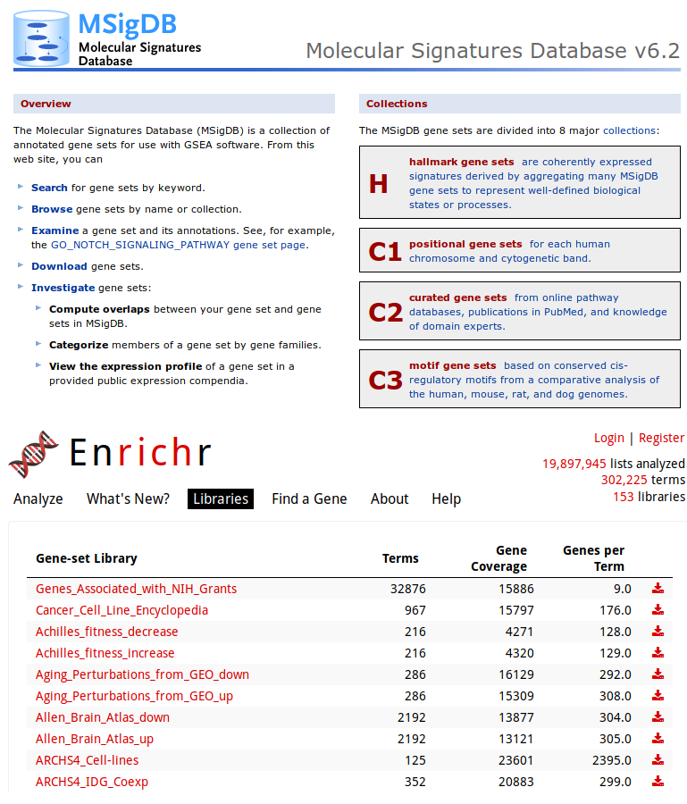
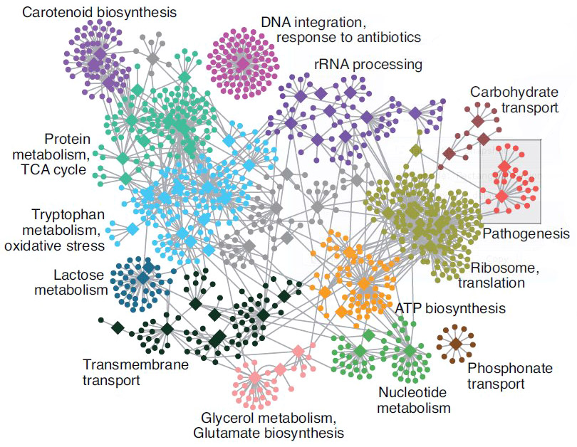
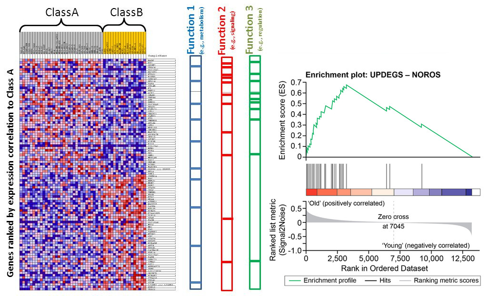

exclude: true
count: false

```{r,echo=FALSE,child="assets/header-presentation.Rmd"}
```

<!-- ------------ Only edit title, subtitle & author above this ------------ -->

```{r,include=FALSE}
# load the packages you need
library(dplyr)
library(tidyr)
#library(stringr)
library(ggplot2)
#library(plotly)
library(pheatmap)
library(DESeq2)
library(edgeR)
```

---
name: content
class: spaced

## Contents

* [Introduction](#intro)
* [Gene sets](#geneset)
* [Gene set analyses](#gsa)
* [Gene set enrichment analyses](#gsea)

---
name: intro

## Introduction

```
  ensembl_gene_id  baseMean log2FoldChange       pvalue    padj
1 ENSG00000000003 490.01721      0.9145204 3.661641e-17 0.00376
2 ENSG00000000419 817.78066     -0.1894651 6.001737e-02 0.04354
3 ENSG00000000457  82.07877      0.3307639 1.207585e-01 0.00005
4 ENSG00000000460 356.07160     -1.8636578 4.096103e-51 0.00025
5 ENSG00000001036 919.60675     -0.3482723 3.922539e-05 0.19231
6 ENSG00000001084 529.59397     -0.6764194 8.192621e-13 0.06244
```

--

> Is there a pattern in my list of DEGs?

--

- Do my DEGs work together?
- Are they involved in a biological process?
- Are they involved in a pathway?
- Reduce gene lists to terms
- Pick interesting genes based on function
- Less prone to false-positives on the gene-level
- Interpretation of genome-wide results

---
name: terminology

## Terminology

- Functional analyses
- Functional annotation
- Gene set analyses (GSA)
- Gene-set enrichment analyses (GSEA)
- GO analyses
- Gene list enrichment analyses
- Over-representation analyses
- hypergeometric test (fisher's exact test)
...

---
name: geneset

## Gene sets

.pull-left-40[
- Curated sets of genes
- [Gene ontology (GO)](http://geneontology.org/)
- [KEGG](https://www.genome.jp/kegg/)
- [Reactome](https://reactome.org/)
- [MolSigDB](http://software.broadinstitute.org/gsea/msigdb/index.jsp)
- [Enrichr](http://amp.pharm.mssm.edu/Enrichr/#stats)
]

.pull-right-60[
.size-90[]
]

---
name: go

## Gene sets • GO

.pull-left-50[
- Three categories: Biological process, Molecular function, Cellular component
- Displayed as a network graph
- Genes are shared between multiple terms


]

.pull-right-50[
- Almost hierarchical
- Terms get detailed down the hierarchy
- A term can have multiple parents


]

---
name: kegg

## Gene sets • Pathways

* KEGG, Reactome etc.


---
name: gsa

## Gene set analyses (GSA)

* Requires cut-off
* Omits any expression metric
* Good to test overlap of signif genes in two comparisons
* Computationally fast

.size-90[]

---
name: gsa-2

## GSA input

```
  ensembl_gene_id  baseMean log2FoldChange       pvalue    padj
1 ENSG00000000003 490.01721      0.9145204 3.661641e-17 0.00376
2 ENSG00000000419 817.78066     -0.1894651 6.001737e-02 0.04354
3 ENSG00000000457  82.07877      0.3307639 1.207585e-01 0.06244
4 ENSG00000000460 356.07160     -1.8636578 4.096103e-51 0.12002
5 ENSG00000001036 919.60675     -0.3482723 3.922539e-05 0.19231
6 ENSG00000001084 529.59397     -0.6764194 8.192621e-13 0.00005
```

Input set: `ENSG00000000003, ENSG00000000419, ENSG00000001084`  
Universe: `ENSG00000000003, ENSG00000000419, ENSG00000000457, ENSG00000000460, ENSG00000001036, ENSG00000001084`  

---
name: gsea

## Gene set enrichment analyses (GSEA)

* All genes are used
* Ranked by an expression metric/gene-level statistic



---
name: gsea-2

## GSEA input

```
  ensembl_gene_id  baseMean log2FoldChange       pvalue    padj
1 ENSG00000000003 490.01721      0.9145204 3.661641e-17 0.00376
2 ENSG00000000419 817.78066     -0.1894651 6.001737e-02 0.04354
3 ENSG00000000457  82.07877      0.3307639 1.207585e-01 0.06244
4 ENSG00000000460 356.07160     -1.8636578 4.096103e-51 0.12002
5 ENSG00000001036 919.60675     -0.3482723 3.922539e-05 0.19231
6 ENSG00000001084 529.59397     -0.6764194 8.192621e-13 0.00005
```

* Input is a set of labelled ranked expression metrics.

```{r,echo=FALSE}
i <- c(0.9145204,-0.1894651,0.3307639,-1.8636578,-0.3482723,-0.6764194)
names(i) <- c("ENSG00000000003", "ENSG00000000419", "ENSG00000000457", "ENSG00000000460", "ENSG00000001036", "ENSG00000001084")
sort(i,decreasing=T)
```

---
name: tools

## Tools

### R packages

topGO, goana, goseq, topKEGG, kegga, enrichR, piano, clusterProfiler, Pathview, fgsea, gprofileR

### Online

[DAVID](https://david.ncifcrf.gov/), [GOrilla](http://cbl-gorilla.cs.technion.ac.il/), [Enrichr](https://amp.pharm.mssm.edu/Enrichr/), [Revigo](http://revigo.irb.hr/), [Webgestalt](http://webgestalt.org/), [Panther](http://pantherdb.org/), [Tair](https://www.arabidopsis.org/tools/go_term_enrichment.jsp)

### Downloadable

[GSEA](http://software.broadinstitute.org/gsea/index.jsp), [ErmineJ](https://erminej.msl.ubc.ca/), [Ingenity Pathway analyses](https://www.qiagenbioinformatics.com/products/ingenuity-pathway-analysis/)

---
name: cons

## Considerations

* Pay attention to gene IDs
* Bias in gene sets
* Confusing gene set names
* Consider gene set size
* Adjust for multiple testing
* Large number of highly overlapping gene-sets (representing a similar biological theme) can bias interpretation and take attention from other biological themes that are represented by fewer gene-sets

---
name: ack

## Acknowledgements

* Slides by Leif Wigge

---
name: end_slide
class: end-slide, middle
count: false

# Thank you. Questions?

```{r,echo=FALSE,child="assets/footer-presentation.Rmd"}
```

```{r,include=FALSE,eval=FALSE}
# manually run this to render this document to HTML
rmarkdown::render("presentation_functional.Rmd")
# manually run this to convert HTML to PDF
#pagedown::chrome_print("presentation_dge.html",output="presentation_dge.pdf")
```
