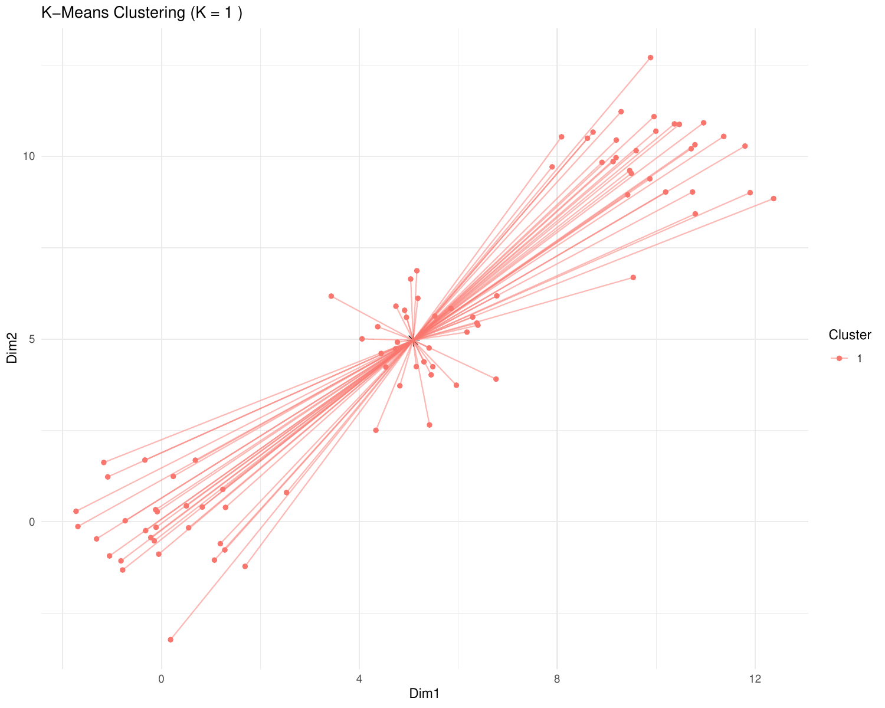

```{r, include = FALSE}
#Load the  packages
library(knitr)
library(ggplot2)
# Following libraries are used for generating the figures:
  #library(factoextra)
  #library(mclust)
  #library(MASS) # For mvrnorm to generate multivariate normal samples
  #library(dbscan)
  #library(cluster)

# functions
calculate_wcss <- function(data, k) {
  kmeans_model <- kmeans(data, centers = k, nstart = 20)
  return(kmeans_model$tot.withinss)
}

# Creating synthetic data
set.seed(123)
data <- rbind(
  matrix(rnorm(90, mean=0), ncol=3),
  matrix(rnorm(90, mean=5), ncol=3),
  matrix(rnorm(90, mean=10), ncol=3)
)
groups <- rep(c('Group1', 'Group2', 'Group3'), each=3)

```


---
name: intro
## Clustering

-   What is clustering?

    -   Clustering is an approach to classify/group data points.

-   Why do we use clustering?

    -   For     exploring the data

    -   To discover patterns in our data set

    -   Identify outliers

---
name: clustering-method
## Clustering Methods

-   Centroid-based

-   Density-based

-   Distribution-based

-   Hierarchical-based

## Steps:

In short all clustering approach follows these steps:

-   Calculate distance between data points

-   Group \| cluster the data based on similarities
---
name: distance-metrics

## Distance can be measured in:

-   In multidimensional space (raw data)

-   In reduced space (i.e. top PCs)

---
name: Euclidean
## Euclidean distance

-   Euclidean distance is a straight line between two points

    $$
    c^2 = a^2 + b^2
    $$

    ```{r euclidean-distance, echo = F, fig.align='center'}
    #| output-location: fragment
    set.seed(123)
    x <- c(19,8,3,4,17,12,6,1,10,11,16,9,7,14,5,19,2,18,13,15)
    y <- c(6,8,12,4,13,16,14,5,7,1,19,10,2,11,9,15,18,17,3,20)
      
    plot(x,y,xlab = 'Dim1', ylab='Dim2')
    arrows(x0=19,y0=13,
            x1=x[1],y1=y[1], col = 'red', angle = 20, length = 0.1)
    text(c((x[1] + 19)/2),
           c((y[1] + 13)/2), labels = 'a', pos = 4, col = 'red')
    arrows(x0=19,y0=13,
            x1=x[5],y1=y[5], col = 'red', angle = 20, length = 0.1)
    text(c((x[5] + 19)/2)-0.5,
         c((y[5] + 13)/2)+0.5, labels = 'b', pos = 4, col = 'red')
    arrows(x0=x[5],y0=y[5],
            x1=x[1],y1=y[1], col = 'red', angle = 20, length = 0.1)
    text(c((x[1] + x[5])/2)-1,
         c((y[1] + y[5])/2), labels = 'c', pos = 4, col = 'red')
    ```

---
name: Manhattan-distance
## Manhattan distance

-   Manhattan distance

    $$
    a + b
    $$

```{r manhattan-distance, echo = F, fig.align='center'}
set.seed(123)
x <- c(19,8,3,4,17,12,6,1,10,11,16,9,7,14,5,19,2,18,13,15)
y <- c(6,8,12,4,13,16,14,5,7,1,19,10,2,11,9,15,18,17,3,20)
  
plot(x,y)
arrows(x0=19,y0=13,
        x1=x[1],y1=y[1], col = 'red', angle = 20, length = 0.1)
text(c((x[1] + 19)/2),
       c((y[1] + 13)/2), labels = 'a', pos = 4, col = 'red')
arrows(x0=19,y0=13,
        x1=x[5],y1=y[5], col = 'red', angle = 20, length = 0.1)
text(c((x[5] + 19)/2)-0.5,
     c((y[5] + 13)/2)+0.5, labels = 'b', pos = 4, col = 'red')
```
---
name: Inverted-pairwise-correlations
## Inverted pairwise correlations

-   Inverted pairwise correlations

    $$
    dist = -(cor -1) / 2
    $$

```{r inverted-pairwise-correlation, echo = F, fig.align='center'}
plot(c(0.5,4.5), c(-2,2), bty = 'n', type = 'n', xaxt = 'n', xlab = ' ', ylab = '', yaxt = 'n')
axis(2,
     at = -1:1,
     labels = c(-1,0,1))
abline(h = c(-1,1), lty = 2)
abline(h=0,lwd=3)
arrows(x0 = 1, y0 = 0,
       x1 = 1, y1 = 1, col = 'red', length = 0.1, lwd = 5)
arrows(x0 = 1, y0 = 0,
       x1 = 1, y1 = -1, col = 'blue', length = 0.1, lwd = 5)
text(x = 1, y = 1, labels = 'cor', pos = 3)
arrows(x0 = 2, y0 = -1,
       x1 = 2, y1 = 0, col = 'red', length = 0.1, lwd = 5)
arrows(x0 = 2, y0 = -1,
       x1 = 2, y1 = -2, col = 'blue', length = 0.1, lwd = 5)
text(x = 2, y = 1, labels = 'cor-1', pos = 3)
arrows(x0 = 3, y0 = 1,
       x1 = 3, y1 = 2, col = 'blue', length = 0.1, lwd = 5)
arrows(x0 = 3, y0 = 1,
       x1 = 3, y1 = 0, col = 'red', length = 0.1, lwd = 5)
text(x = 3, y = -0.5, labels = '-(cor-1)', pos = 3)
arrows(x0 = 4, y0 = 0.5,
       x1 = 4, y1 = 1, col = 'blue', length = 0.1, lwd = 5)
arrows(x0 = 4, y0 = 0.5,
       x1 = 4, y1 = 0, col = 'red', length = 0.1, lwd = 5)
text(x = 4, y = 1, labels = '-(cor-1)/2', pos = 3)

```

---
name: Mahalanobis-Distance
## Mahalanobis Distance

-   Despite of previous approach which was based on distance between data points, this method measures the distance between a data point and a distribution.

```{r mahalanobis-plot, echo = F, out.width='60%', fig.align='center'}

```


```{r, echo = F, fig.align='center', eval = F}
# Generate a dataset of 2 variables
set.seed(42)
data <- mvrnorm(n = 300, mu = c(0, 0), Sigma = matrix(c(1, 0.9, 0.9, 1), ncol = 2))
colnames(data) <- c("X1", "X2")

# Define a point
point1 <- c(1, 1)
point2 <- c(1, -1)

# Calculate Euclidean distance from the center (0,0)
euclidean_distance <- sqrt(sum((point - colMeans(data))^2))

# Correct calculation of Mahalanobis distance
mahalanobis_distance <- sqrt(t(matrix(point - colMeans(data))) %*% solve(var(data)) %*% matrix(point - colMeans(data)))

png('data/Mahalanobis.png', width = 1000, height = 1000,res = 150)
# Create a base plot
plot <- ggplot(data.frame(data), aes(x = X1, y = X2)) + 
  geom_point(color = "blue") + 
  geom_point(aes(x = 0, y = 0), color = "red", size = 3) + 
  geom_point(aes(x = point1[1], y = point1[2]), color = "green", size = 3) +
  geom_point(aes(x = point2[1], y = point2[2]), color = "darkgreen", size = 3) +
  ggtitle("Mahalanobis Distance") +
  theme_minimal() + theme(plot.title = element_text(hjust = 0.5))

# Display the plot
print(plot)
dev.off()
```

---
name: Centroid-based1
## Centroid-based: K-means clustering
-   One of the most commonly used clustering methods

-   In this method the distance between data points and centroids is calculated

-   Each data point is assigned to a cluster based on Euclidean distance from centroid.

-   Dependent on number of K (clusters) new centroids are created

<div style="text-align: center;">

</div>

```{r kmeans-create, echo = F, eval = F, fig.align='center'}
# Load necessary libraries
library(ggplot2)

set.seed(123)
kmeans_result <- kmeans(data, centers=3)

k_values <- 1:5
png('data/kmeans_3.png', width = 10, height = 1000)
for(k in k_values){
  kmeans_result <- kmeans(data, centers = k, nstart = 20)
  df_kmeans <- data.frame(PC1 = data[,1], PC2 = data[,2], Cluster = as.factor(kmeans_result$cluster))
  
  # Adding centroid coordinates to the dataframe
  centroids <- as.data.frame(kmeans_result$centers)
  names(centroids) <- c("Centroid_PC1", "Centroid_PC2")
  centroids$Cluster <- as.factor(1:k)
  
  # Merging the centroids back into the dataframe for plotting
  df_plot <- merge(df_kmeans, centroids, by = "Cluster")
  
  # Plotting with ggplot
  p <- ggplot(df_plot, aes(x = PC1, y = PC2, color = Cluster)) +
    geom_point() +
    geom_point(data = centroids, aes(x = Centroid_PC1, y = Centroid_PC2), color = "black", size = 3, shape = 8) +
    geom_segment(aes(xend = Centroid_PC1, yend = Centroid_PC2), alpha = 0.5) +
    scale_color_discrete(name = "Cluster") +
    labs(title = paste("K-Means Clustering (K =", k, ")"), x = "Dim1", y = "Dim2") +
    theme_minimal()
  
  print(p)
  # Sys.sleep(2)
  
}
dev.off()
```
---
name: Centroid-based2
## Centroid-based: K-means clustering
-   One of the most commonly used clustering methods

-   In this method the distance between data points and centroids is calculated

-   Each data point is assigned to a cluster based on Euclidean distance from centroid.

-   Dependent on number of K (clusters) new centroids are created

<div style="text-align: center;">

</div>


```{r kmeans-create-k-3, echo = F, eval = F, fig.align='center'}
# # Create a synthetic dataset
set.seed(123) # For reproducibility
data <- data.frame(x = rnorm(90, mean = 0),
                   y = rnorm(90, mean = 0))
# data <- data.frame(data)
# names(data) <- c("x", "y", "z")
k <- 3 # Number of clusters

# Initial centroids (randomly selecting 3 points from the dataset in this example)
set.seed(123) # For reproducibility
initial_centroids <- data[sample(nrow(data), k), ]

# K-means clustering step-by-step

n_iterations <- k # Number of iterations to perform (for demonstration)
pdf('data/kmeans_3.pdf', width = 10, height = 8)
for (i in 1:n_iterations) {
  # Assign points to the nearest centroid
  distances <- as.matrix(dist(rbind(data, initial_centroids)))
  distances <- distances[1:nrow(data), (nrow(data)+1):(nrow(data)+k)]
  cluster_assignment <- apply(distances, 1, which.min)
  
  # Update centroids
  new_centroids <- aggregate(data[,c("x", "y")], by = list(cluster_assignment), FUN = mean)
  new_centroids <- new_centroids[, -1] # Removing the grouping column
  
  
  # Plotting
  p <- ggplot(as.data.frame(data), aes(x = x, y = y)) +
    geom_point(aes(color = factor(cluster_assignment))) +
    geom_point(data = new_centroids, aes(x = x, y = y), color = 'black', size = 5) +
    geom_segment(data = data, aes(xend = new_centroids[cluster_assignment, "x"],
                                  yend = new_centroids[cluster_assignment, "y"],
                                  x = x, y = y), color = 'grey', alpha = 0.5) +
    labs(title = paste("Iteration:", i)) +
    theme_minimal()
  
  print(p)
  # For the next iteration
  initial_centroids <- new_centroids
}
dev.off()
```
---

name: optimal k
## What is optimal K?

- The user needs to define the number of clusters:
  - **Elbow method**. 
  - Gap statistics. 
  - Average Silhouette method
  
  

```{r optimal-k, echo = F, fig.align='center', fig.height=5, fig.width=10}
set.seed(123) # For reproducibility
data <- rbind(
  matrix(rnorm(90, mean=0), ncol=3),
  matrix(rnorm(90, mean=5), ncol=3),
  matrix(rnorm(90, mean=10), ncol=3)
)
groups <- rep(c('Group1', 'Group2', 'Group3'), each=3)


par(mfrow = c(1, 2))
k_values <- 1:10
wcss_values <- sapply(k_values, function(k) calculate_wcss(data, k))

plot(k_values, wcss_values, type = "b", pch = 16, col = "blue", 
     xlab = "Number of Clusters (K)", ylab = "Within-Cluster Sum of Squares (WCSS)",
     main = "Elbow Method for Optimal K")
# knitr::include_graphics('data/kmeans_3.png')
k <- 3
kmeans_result <- kmeans(data, centers = k, nstart = 20)
df_kmeans <- data.frame(PC1 = data[,1], PC2 = data[,2], Cluster = as.factor(kmeans_result$cluster))
plot(df_kmeans$PC1, df_kmeans$PC2, col = df_kmeans$Cluster, pch = 16,
     main = paste("K-Means Clustering (K =", k, ")"), xlab = 'Dim1', ylab = 'Dim2')
par(mfrow = c(1, 1))
``` 
???
Within-cluster sum of squares (WCSS) is a metric used to quantify the compactness of clusters by measuring the squared distances from each point to its cluster centroid. It serves as a key indicator for determining the optimal number of clusters in a dataset. In the Elbow method, the objective is to identify a suitable number of clusters (k) by locating the point where increases in k result in diminishing reductions in WCSS. This 'elbow' point is considered optimal because beyond it, additional clusters do not significantly enhance the model's performance in terms of intra-cluster compactness.
---
name: DBSCAN
## Density-based clustering: DBSCAN

-   This method identifies regions within your data distribution that exhibits high density of data points.

```{r dbscan, echo = F, fig.align='center', eval = F}

# Perform DBSCAN clustering
dbscan_result <- dbscan(data, eps = 2, minPts = 2)

# Visualization
df_dbscan <- data.frame(PC1 = data[,1], PC2 = data[,2], Cluster = as.factor(dbscan_result$cluster))
ggplot(df_dbscan, aes(x = PC1, y = PC2, color = Cluster)) + geom_point() + ggtitle("DBSCAN Clustering")

```
---
name: GMM
## Distribution-based clustering: Guassian Mixture Model (GMM)

-   It involves modeling the data points with probability distribution.

-   In this method prior knowledge on distribution of your data is required. If you do not know the distribution of your data try another approach.

-   You need to specify number of clusters.

???
Distribution-based clustering involves modeling the data points using probability distributions, with the Gaussian Mixture Model (GMM) being one of the most commonly used methods in this category. In a GMM, each cluster is modeled as a Gaussian distribution, and the algorithm iteratively updates the parameters of these distributions (mean, covariance) and the probability of each point belonging to each cluster.

```{r gmm, echo = F, fig.align='center', eval = F}

# Perform GMM clustering
gmm_result <- Mclust(data)

# Visualization
df_gmm <- data.frame(PC1 = data[,1], PC2 = data[,2], Cluster = as.factor(gmm_result$classification))
ggplot(df_gmm, aes(x = PC1, y = PC2, color = Cluster)) + geom_point() + ggtitle("Gaussian Mixture Model Clustering") + xlab('Dim1') + ylab('Dim2')
```
---
name: hclust
## Hierarchical-based clustering

- This approach creates a tree of clusters. 
- Well suited for hierarchical data (e.g. taxonomies). 
- Final output is a dendrogram representing the order decisions at each merge/division of clusters.  
- Two approaches:
  - Agglomerative (Bottom-up): All data points are treated as clusters and the joins similar ones. 
  - Divisive (Top-down): All data points are in one large clusters and recursively splits the most heterogeneous clusters.  
- Number of clusters are decided after generating the tree.  
---
name: hclust-agglomorative
## Hierarchical-based clustering
- Agglomerative clustering

```{r hc-agglomerative-fig, echo = F, out.width='60%'}

```

```{r hc-agglomerative, echo = F, eval = F, fig.align='center'}
set.seed(42) # For reproducibility
# Generate sample data
# data <- matrix(rnorm(100), ncol = 2)
# colnames(data) <- c("Feature1", "Feature2")
data <- matrix(c(1, 1, 2, 1, 3, 2, 5, 4, 6, 5), ncol = 2, byrow = TRUE)
colnames(data) <- c("X", "Y")
rownames(data) <- LETTERS[1:5]
# Perform agglomerative hierarchical clustering
hc_agglomerative <- hclust(dist(data), method = "complete")

# Plot the dendrogram
png('data/HC-agglomerative.png', width = 1000, height = 1000, res = 100)
plot(hc_agglomerative, main = "Agglomerative Hierarchical Clustering")
dev.off()
```
---
name: hclust-divisive
## Hierarchical-based clustering
- Divisive clustering

```{r hc-divisive-fig, echo = F, out.width='60%'}

```

```{r hc-dvisive, echo = F, fig.align='center', eval=FALSE}
# Perform divisive hierarchical clustering

hc_divisive <- diana(data)

# Plot the dendrogram
png('data/HC-divisive.png', width = 1000, height = 1000, res=100)
pltree(hc_divisive, cex = 0.6, main = "Divisive Hierarchical Clustering")
dev.off()
```

---
name: linkage
## Linkage methods. 
To combine clusters, it's essential to establish their positions relative to one another. The technique used to determine these positions is known as **Linkage**.  

```{r linkage, echo = F, eval = T, out.width = '60%', fig.align='center'}

```
---
name: linear-clustering-summary
## Summary 

- For bulk RNASeq you can perform clusteirng on raw or Z-Score scaled data. 

- For the sample size is large (>10,000) you can perform clustering on PC. For instance in scRNASeq data. 

- You always need to tune some parameters.  

- K-means performs poorly on unbalanced data. 

- On hierarchical clustering, some distance metrics need to be used with a certain
linkage method.  

- Checking clustering Robustness (a.k.a  Ensemble perturbations):
    - Most clustering techniques will cluster random noise.  
    - One way of testing this is by clustering on parts of the data (clustering bootstrapping)
    - Read more in [Ronan et al (2016) Science Signaling](https://www.science.org/doi/10.1126/scisignal.aad1932?url_ver=Z39.88-2003&rfr_id=ori:rid:crossref.org&rfr_dat=cr_pub%20%200pubmed)).  
---
name: Know more
## Do you want to know more
Please check the following links:
- [Avoiding common pitfalls when clustering biological data](https://www.science.org/doi/10.1126/scisignal.aad1932?url_ver=Z39.88-2003&rfr_id=ori:rid:crossref.org&rfr_dat=cr_pub%20%200pubmed)
- [Clustering with Scikit with GIFs](https://dashee87.github.io/data%20science/general/Clustering-with-Scikit-with-GIFs/) (Note, this is based on python but provide nice illustration).  
---
name: end_slide
class: end-slide, middle
count: false

# Thank you. Questions?


