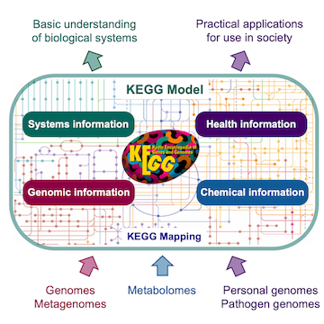

```{r, include = FALSE}
#Load the  packages
library(factoextra)
library(mclust)
library(MASS) # For mvrnorm to generate multivariate normal samples
library(ggplot2)
library(dbscan)
library(DT)

# functions
calculate_wcss <- function(data, k) {
  kmeans_model <- kmeans(data, centers = k, nstart = 20)
  return(kmeans_model$tot.withinss)
}
```

```{r ora-log10p, echo = F, eval = F}
# Assuming ora_results is a dataframe with 'Category' and '-log10(p-value)' columns
ora_results <- data.frame(
    Category = c("Pathway A", "Pathway B", "Pathway C", "Pathway D", "Pathway E", "Pathway F"),
    `log10.p.value` = c(1, 1, 2, 3, 4, 4) # Example data
)

# Create a bar plot
ggplot(ora_results, aes(x=reorder(Category, `log10.p.value`), y=`log10.p.value`)) +
    geom_bar(stat="identity", fill="skyblue") +
    coord_flip() + # Flip the coordinates to make the plot horizontal
    labs(x="Pathway", y="-log10(p-value)", title="Overrepresentation Analysis Results") + theme(panel.grid = element_blank()) + theme_bw()
```


---
name: intro
## Introduction

- What do the identified DEG do?

- How can we link them to phenotype/diseases/biological feature we study?

- We can do that by exploring their function and in which pathways they are involved. 

- Although differential expression analyses result into some genes but can we manually do that for all of them?

- There are different approaches and dependent on available data we can expand it.  

- At transcriptome level:

  - **Gene set analysis (GSA)**
---
name: GSA
## Why GSA?

- Biological interpretation of the results; From gene list to biological insights!  

- Reduce the complexity; Identifying key biological processes that are affected under the experiment or condition.  

- Integrating external information. 

- Cross-experiment comparisons; We can compare the results across different studies and experimental platforms.   

```{r pathview-example, echo = F, fig.align='center', out.width='50%'}

```

---
name: GS-resource
## Gene set resources/databases
- **Gene Ontology (GO). ** 

```{r GO, echo = F, fig.align='right', out.width='20%'}
knitr::include_graphics('data/GO.png')
```


- **Pathways (Kyoto Encyclopedia of Genes and Genomes (KEGG)). ** 
```{r KEGG, echo = F, fig.align='right', out.width='10%'}
knitr::include_graphics('data/KEGG.jpeg')
```

- Protein-protein interaction (PPI)
```{r PPI, echo = F, fig.align='right', out.width='20%'}

```
- Cell type

- Chromosomal location

- Metabolic and Signaling pathway. 

- Diseases
---
name: GO
# Gene Ontology
- It is a resource to unify the representation of gene/gene products in to hierarchical categories:
  - Biological Process (BP); _Cell cycle, Signal transduction_. 
  - Molecular Function (MF); _Phosphorylation, DNA binding_. 
  - Cellular Component (CC); _Nucleus, Cytoplasm_. 
- Genes can belong to multiple GO *terms*
```{r GO-example, echo = F, out.width='60%', fig.align='center'}

```

---
name: pathway1
# Pathway
Can you unravel the mystery of this pathway?  

```{r pathway-example1, echo = F, out.width='100%', fig.align='center'}
knitr::include_graphics('data/Tokyo_Metro.jpeg')
```
---
name: pathway
# Pathway

- Biology is complex but has an organized structure. 
```{r kegg1, echo=FALSE, results='asis', out.width='40%'}
cat('
<div style="display: flex; justify-content: space-around;">
  
</div>
')
``` 
---
name: kegg
# KEGG

- KEGG is a comprehensive database resource that integrates genomic, chemical, and systemic functional information. It provides data on biological pathways, genomes, diseases, drugs, and chemical substances. KEGG is widely used for bioinformatics research, including the study of gene functions and networks.


```{r kegg2, echo=FALSE, results='asis', out.width='50%', fig.align='center'}

``` 
---

name: wikipathway
# Wikipahtway

- WikiPathways is an open, collaborative platform dedicated to the curation of biological pathways. 

```{r wikipathway, echo=FALSE, results='asis', out.width='40%'}

``` 

- It allows scientists from various fields to contribute to and edit pathway information, offering a wide range of pathways for research and education purposes. 

- The database facilitates the visualization and analysis of pathway information to support understanding of complex biological processes.

---
name: Reactome
# Reactome 

- Reactome is a curated database of pathways and reactions in human biology. 

- It covers various aspects of human biology, including metabolism, signaling, molecular transport, and cellular processes. 

- Reactome provides tools for visualization, interpretation, and analysis of pathway data, making it a valuable resource for researchers in genomics and systems biology.  

```{r reactome, echo = F, fig.align='center', out.width='80%'}

```
---
name: Transcription Factor
# Transcription Factor databases

- There are different databases compile information about TF, their DNA binding sites and regulatory network they form:  
  - TRANSFAC. 
  - JASPAR. 
  - ENCODE. 
---
name: Hallmark
# Hallmark Gene Set

- The Hallmark gene set is part of the Molecular Signatures Database (MSigDB), which is a collection of annotated gene sets for use with GSEA (Gene Set Enrichment Analysis) software. 

- The Hallmark gene set distills complex gene signatures into a concise set of gene sets that represent specific and well-defined biological states or processes. 

- These gene sets are designed to be universally applicable for annotating gene expression patterns in a wide variety of biological contexts.

```{r msigdb, echo = F, fig.align='center', out.width='50%'}

```
---
name: gene-sets
# Where to get gene sets for the analyses?


```{r genesetdb, echo=FALSE, results='asis', out.width='40%'}
cat('
<div style="display: flex; justify-content: space-around;">
  
  
</div>
')
``` 
---
name: GSA
# Gene set analysis methods

- Overrepresentation analysis (ORA):

  - A statistical method for identifying terms (e.g. GO terms or pahtways) that are more represented in a given gene/protein set than expected by chance.  
  
- Gene Set Enrichment Analysis (GSEA):

  - A statistical method for evaluating the distribution of genes across a ranked list of gene showing the same signature (upregulated or downregulated) which happen to be involved in a given category (e.g. pathway).    
---
name: ORA
# ORA 

- It is a hypergeometric test (Fisher's exact test)

- Selected genes are differentially expressed genes (DEG: Up or Down)

- Category can be GO, Pathway,....


```{r ora-example, echo=FALSE, fig.align='center', out.width='80%'}

```
---
name: ORA1
# ORA


```{r ora-example1, echo=FALSE, fig.align='center', out.width='80%'}

```

---
name: GSEA1
# GSEA 

- In GSEA we do not have any prior selection of the genes (such as DEG)

- Genes are listed by logFC and their distribution is tested with a statistical test adapted from Kolmogrov-smirinov test. This test calculates an enrichment score (ES) for each predefined gene set wjocj reflects the degree to which the genes in the set are overrepresented at the extremes (top or bottom) of the ranked list. In other words, it tries to identify maximum deviation form zero. 

```{r gsea-example, echo=FALSE, fig.align='center', out.width='60%'}

```
---
name: GSEA1
# GSEA

- Few notes:

  - The ES differ among tested pathways/terms. Thus use Normalized Enrichment Score (NES).  
  
  - Some genes may be involved in different pathways and thus can bias interpretation.
  
  - As an alternative, topology-based method has been introduced which takes gene-set interaction into account. ([Ma et al., 2019](https://bmcbioinformatics.biomedcentral.com/articles/10.1186/s12859-019-3146-1)).
  

```{r gsea-notes, echo=FALSE, fig.align='center', out.width='60%'}

```
---
name: summary
# Consideration for GSA

- Be mindful of choosing appropriate thresholds when identifying differentially expressed genes (DEGs) for further analysis.

- Gene-set names can be misleading.  

- GSEA is sensitive to the size of gene-set.  

- In ORA, the method does not account for the fact that not all genes contribute equally to a biological process or pathway. In this test, genes are treated in binary fashion (In a pathway or Nor in a pathway). 

- There is not a linear relationship between genes and gene-sets; Not all the time upregulation/downregulation of genes can increase/decrease the activity of given pathway. They may suppress/activate that pathway. 

- Analyzing outcomes within a pathway that contains both upregulated and downregulated genes can be challenging. 

---
name: end_slide
class: end-slide, middle
count: false

# Thank you. Questions?